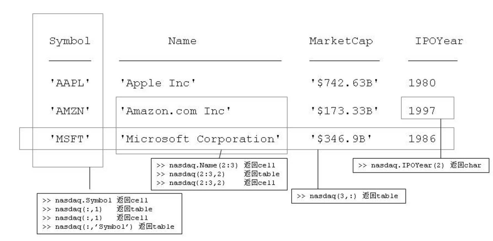

[toc]

## 创建

### 1. 由列向量直接创建 table

```matlab
name={'Abby';'Bob';'Charlie'};                        % 3x1列向量
number={'5086470001';'5086470002';'5086470003'};      % 3x1列向量
colName={'Name','Number'};                            % 表头
phonetable=table(name,number,'VariableNames',colName)

phonetable = 
      Name          Number   
    _________    ____________

    'Abby'       '5086470001'
    'Bob'        '5086470002'
    'Charlie'    '5086470003'
```

**注意**

- 表头中必须是字符数组，不能是字符串数组，即必须用**单引号**
- 表头中不能有空格

### 2. array2table

由 array 创建 table

```matlab
>> a = [1  6.21; 5 31.03; 10 62.06]
a =
    1.0000    6.2100
    5.0000   31.0300
   10.0000   62.0600

>> t = array2table(a,'VariableNames',{'USD' 'CNY'})   % 通过VariableNames提供表头信息
t = 
    USD     CNY 
    ___    _____
     1      6.21
     5     31.03
    10     62.06    
```

如果把table再转成array，表头的信息将会被剥去

```matlab
>> ap = table2array(t)
ap =
    1.0000    6.2100
    5.0000   31.0300
   10.0000   62.0600
```

### 3. 由 cell2table

```matlab
>> Patients = {'Gender' 'Age' 'Height' 'Weight' 'Smoker';...
    'M' 38 71 176 true;...
    'M' 43 69 163 false;...
    'F' 40 67 133 false;...
    'F' 49 64 119 false}
>> C = Patients(2:end, :);
>> T = cell2table(C)  % 表头按照 cell 变量名自动确定

T =

  4×5 table

    C1     C2    C3    C4      C5  
    ___    __    __    ___    _____

    'M'    38    71    176    true 
    'M'    43    69    163    false
    'F'    40    67    133    false
    'F'    49    64    119    false

>> T.Properties.VariableNames = Patients(1,:)  % 重新定义表头

T =

  4×5 table

    Gender    Age    Height    Weight    Smoker
    ______    ___    ______    ______    ______

     'M'      38       71       176      true  
     'M'      43       69       163      false 
     'F'      40       67       133      false 
     'F'      49       64       119      false 
```

### 4. struct2table

```matlab
>> s.USD = [1 ; 5 ;10];
>> s.CNY = [6.21 ;31.03; 62.06];
>> t = struct2table(s)      % 输入s是标量
t = 
    USD     CNY 
    ___    _____
     1      6.21
     5     31.03
    10     62.06 
```

## 访问 table 中的数据

- 按表头的变量名访问列
- 圆括号+下标，返回 table
- 花括号+下标，返回 cell



## table 操作

### 1. 删除行、列

```matlab
>> T(3, :) = []  % remove 3rd row
T =

  3×5 table

    Gender    Age    Height    Weight    Smoker
    ______    ___    ______    ______    ______

     'M'      38       71       176      true  
     'M'      43       69       163      false 
     'F'      49       64       119      false 

>> T(:, 2) = []  % remove 2nd column
T =

  3×4 table

    Gender    Height    Weight    Smoker
    ______    ______    ______    ______

     'M'        71       176      true  
     'M'        69       163      false 
     'F'        64       119      false 

>> T.Weight = [] % remove 'Weight' column
T =

  3×3 table

    Gender    Height    Smoker
    ______    ______    ______

     'M'        71      true  
     'M'        69      false 
     'F'        64      false 
```

### 2. 添加行、列

添加行

```matlab
>> newRow = {'F', 70, true};
>> T = [T; newRow]
T =

  4×3 table

    Gender    Height    Smoker
    ______    ______    ______

     'M'        71      true  
     'M'        69      false 
     'F'        64      false 
     'F'        70      true  
```

添加列

```matlab
>> T.Name = {'Zhao'; 'Qian'; 'Sun'; 'Li'};
T =

  4×4 table

    Gender    Height    Smoker     Name 
    ______    ______    ______    ______

     'M'        71      true      'Zhao'
     'M'        69      false     'Qian'
     'F'        64      false     'Sun' 
     'F'        70      true      'Li'  
```

### 3. 合并 table

语法与合并矩阵类似

```matlab
t1 = 
      Name          Number   
    _________    ____________

    'Abby'       '5086470001'
    'Bob'        '5086470002'
    'Charlie'    '5086470003'

t2 = 
     Name         Number   
    _______    ____________

    'Dave'     '5086470004'
    'Eric'     '5086470005'
    'Frank'    '5086470006'

t3 = 
    Office    Building
    ______    ________

    '331'     'A1'    
    '201'     'A2'    
    '328'     'A4' 

>> new_t =[t1; t2]  % 纵向合并
new_t = 
      Name          Number   
    _________    ____________

    'Abby'       '5086470001'
    'Bob'        '5086470002'
    'Charlie'    '5086470003'
    'Dave'       '5086470004'
    'Eric'       '5086470005'
    'Frank'      '5086470006'

>> new_t = [t1,t3]  % 横向合并
new_t = 
      Name          Number       Office    Building
    _________    ____________    ______    ________

    'Abby'       '5086470001'    '331'     'A1'    
    'Bob'        '5086470002'    '201'     'A2'    
    'Charlie'    '5086470003'    '328'     'A4'    
```

### 4. 排序

```matlab
nasdaq = 
    Symbol             Name              MarketCap    IPOYear
    ______    _______________________    _________    _______

    'AAPL'    'Apple Inc'                742.63       1980   
    'AMZN'    'Amazon.com Inc'           173.33       1997   
    'MSFT'    'Microsoft Corporation'     346.9       1986   

>> sortrows(nasdaq,'MarketCap','descend')
ans = 
    Symbol             Name              MarketCap    IPOYear
    ______    _______________________    _________    _______

    'AAPL'    'Apple Inc'                742.63       1980   
    'MSFT'    'Microsoft Corporation'     346.9       1986   
    'AMZN'    'Amazon.com Inc'           173.33       1997   
```

### 5. 筛选

```matlab
>> nasdaq(nasdaq.MarketCap > 200,:)
ans = 
    Symbol             Name              MarketCap    IPOYear
    ______    _______________________    _________    _______

    'AAPL'    'Apple Inc'                742.63       1980   
    'MSFT'    'Microsoft Corporation'     346.9       1986  

>> nasdaq( (nasdaq.MarketCap > 200) & (nasdaq.IPOYear > 1985),:)
ans = 
    Symbol             Name              MarketCap    IPOYear
    ______    _______________________    _________    _______

    'MSFT'    'Microsoft Corporation'    346.9        1986   

>> nasdaq(strcmp(nasdaq.Symbol,'AMZN'),:)
ans = 
    Symbol          Name          MarketCap     IPOYear
    ______    ________________    __________    _______
    'AMZN'    'Amazon.com Inc'    '$173.33B'    1997 
```

## 文件读写

```matlab
>> nasdaq = readtable('nasdaq.csv') 
>> wrietable(nasdaq, 'mydata.csv') 
```
