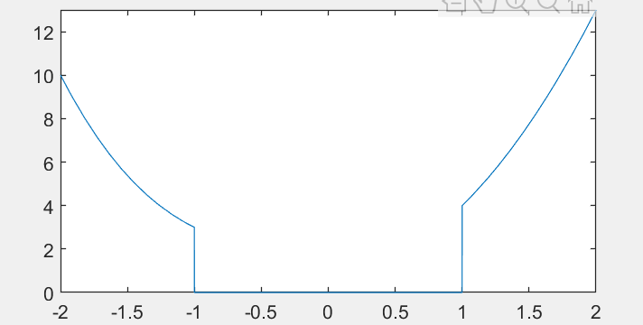

[toc]

## 一些函数

### 取整

- `round` 四舍五入
- `ceil`  向上取整(天花板)
- `floor` 向下取整(地板)

### deal

同时给多个变量赋值

```matlab
>> [a,b,c] = deal(1,2,3)
a =
     1

b =
     2

c =
     3
```

### eval

`eval()` 将括号内的字符串视为语句并运行

- 比如 `eval('y1=sin(2)')`和`y1=sin(2)`等价
- 多在循环中使用，可以对多个**名字有规则的变量**或文件进行操作

```matlab
for x = 1:5
    eval(['y',num2str(x),'=',num2str(x^2),';'])
end
% 运行后，得到变量 y1=1, y2=4, y3=0, y4=16, y5=25
```

### for 循环不出现下标

```matlab
z  =  [1,  3,  7,  11,  15];
for  each  =  z
    disp(each);
end
```

- 有点类似于`python`中的`for...in`
- 如果被循环变量为矩阵，则每次循环表示一列

### 分段函数

```matlab
f=@(x) (3*x.^2+1).*(x>=1) + (2-x.^3).*(x<=-1);
fplot(f,[-2,2])
```



### 变量有效性检查

验证**单个**参数

```matlab
validateattributes(A, classes, attributes)
```

- `classes`: 变量类型, 可以是`'int8'`, `'int16'`, `'single'`, `'double'`, `'char'`, `'string'`, `'struct'`, `'cell'`, `'table'`, `'numeric'`等, 也可以是自定义的类
- `attributes`: 变量属性, `'column'`, `'row'`, `'scalar'`, `'vector'`, `'size',[d1,...dN]`, `'diag'`, `'>=',N`, `'nonnan'`, `'even'`, `'odd'`, `'integer'`, `'real'`, `'positive'`, `'increasing'`等  

验证**多个**参数, 用于子函数中的输入变量检查 % todo

```matlab
inputParser()
```

### 其它

- `smooth` 移动平均滤波
- `medfilt1` 中值滤波
- `nargin` 返回值为函数输入变量的个数
- `return` 直接跳出子程序
- `pwd` 获取当前路径
- `dbstop if error` 运行出错，自动暂停。也可用工具栏 `run/pause on error`打开
- `class` 检查变量类型
- `whos` 检查变量
