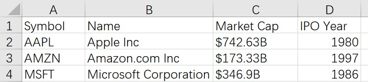

[toc]

## xls 文件

```matlab
[NUM] = xlsread('example', 2, 'A3:D7')
```

读取 excel 文件中的第 2 个 sheet 中 A3:D7 的数据

## csv 文件

### 读入

#### 纯数值文件, 用`csvread`, 返回 **Array** 对象

```matlab
M = csvread(filename, row, column)  % row/column 从0开始标！！！
```

#### 含有文本的文件



`importdata`, 返回 **Struct** 对象

```matlab
>> nasdaq = importdata('nasdaq.csv')
nasdaq =                          % 结果存在struct中
        data: [3x1 double]
    textdata: {4x4 cell}
>> nasdaq.data                    % csv中的数值部分
ans =
        1980
        1997
        1986  
>> nasdaq.textdata                % csv中的字符部分
ans = 
    'Symbol'      'Name'                     'Market Cap'      'IPO Year'
    'AAPL'        'Apple Inc'                '$742.63B'        ''          
    'AMZN'        'Amazon.com Inc'           '$173.33B'        ''          
    'MSFT'        'Microsoft Corporation'    '$346.9B'         ''  
```

`readtable`, 返回 **Table** 对象

```matlab
>> nasdaq = readtable('nasdaq.csv')
Warning: Variable names were modified to make them valid MATLAB identifiers. 
nasdaq =                                                                
    Symbol             Name              MarketCap     IPOYear
    ______    _______________________    __________    _______
    'AAPL'    'Apple Inc'                '$742.63B'    1980   
    'AMZN'    'Amazon.com Inc'           '$173.33B'    1997   
    'MSFT'    'Microsoft Corporation'    '$346.9B'     1986  
```

- readtable 函数把nasdaq.csv中的第一行自动变成了这个table的表头
- 在创建table对象的时候，MATLAB会对做表头的文字做处理，这里把Market Cap和IPO Year两个词中的空格去掉，缩成一个词，这样做是为了方便将来使用dot语法来访问表中的数据
- 因为MATLAB修改了原来的表头，所以这里给出了warning

### 写入

- cell 类型数据不能直接存入 .csv文件
- 先用 `cell2table` 转为 table 类型
- 再用 `writetable(T,filename)`将变量 T 写入 csv 文件

## mat 文件

```matlab
cell2mat(struct2cell(load('qiyipuzong.mat')))
```

- `load`命令读取原先由数组或矩阵保存的 mat 文件，会得到一个struct 类型的变量
- 想要原始的矩阵或者数组, 需要在`load`之后，进行上述两次转换
