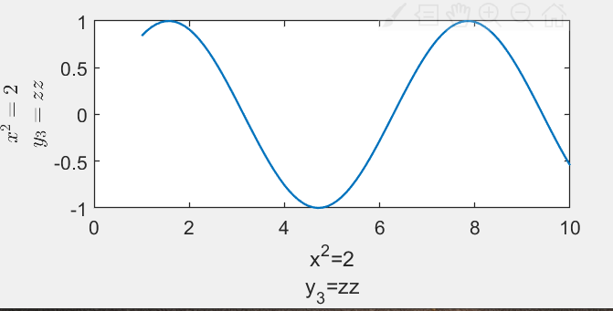

## text 函数

### 对齐方式

```matlab
text(x, y, str)
```

- 默认为左对齐，即`str`的左侧在`(x,y)`
- 用 `'HorizontalAlignment', 'center'` 设置**水平**方向的**居中**对齐

### 换行

字符串内换行，中间加`;`，整体`{}`将**两个字符串**合并起来。用 LaTex 解析时，同理。

```matlab
xlabel({'x^2=2'; 'y_3=zz'})
ylabel({'$x^2=2$'; '$y_3=zz$'}, 'interpreter', 'latex')
```


